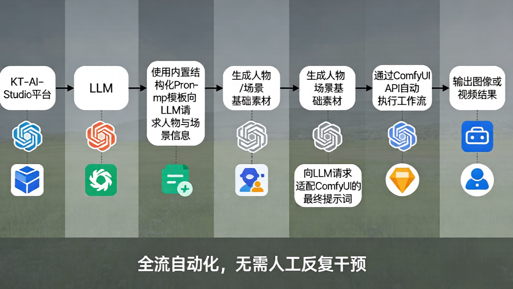
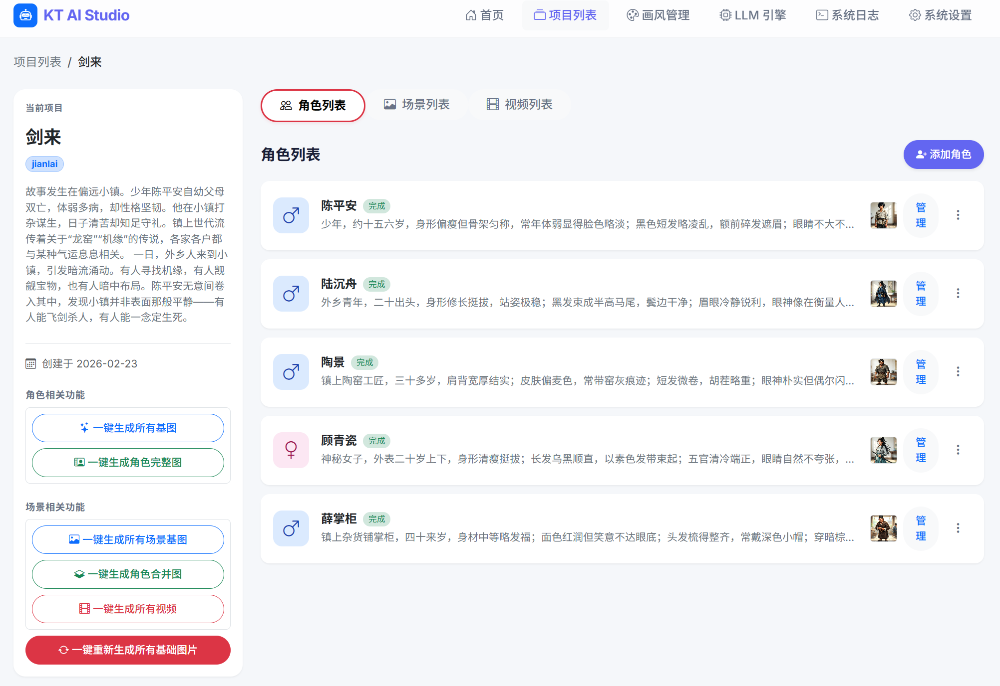
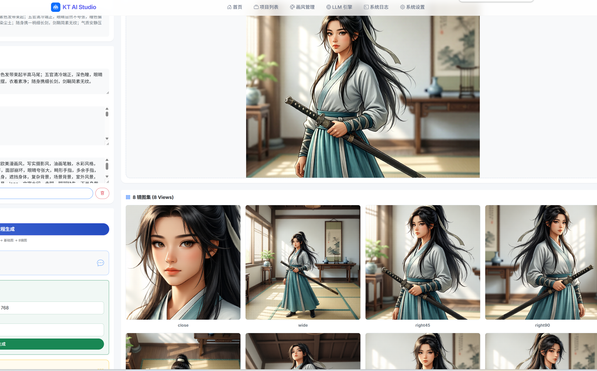
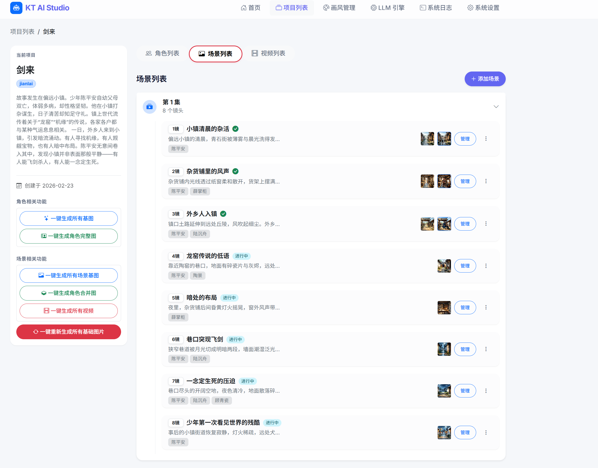
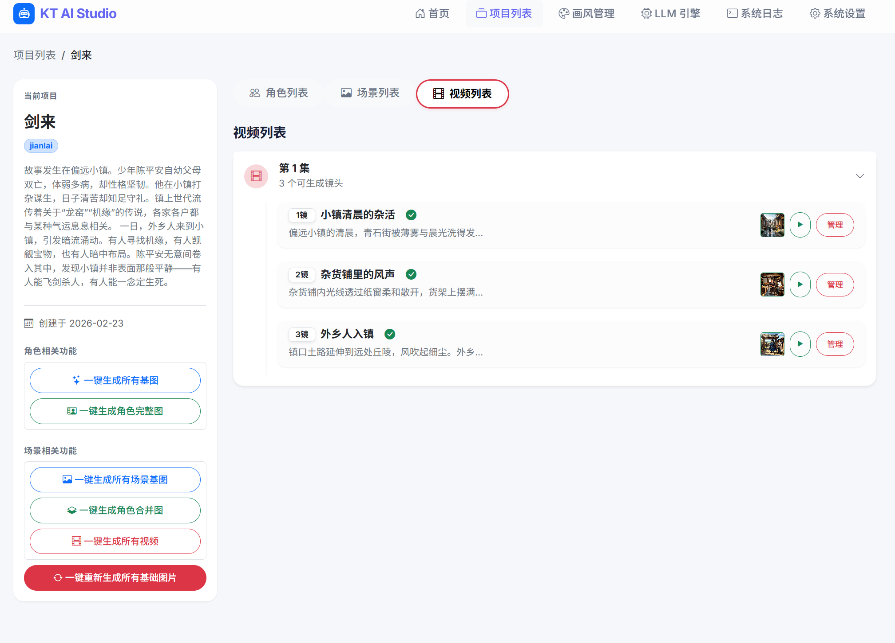
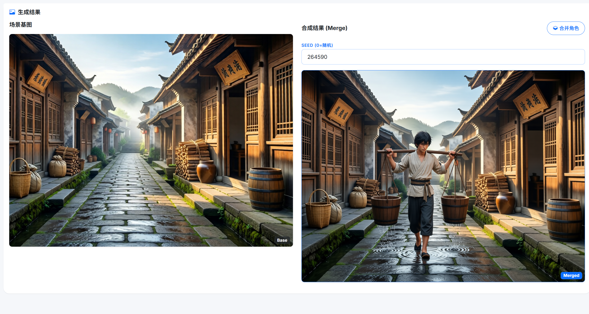
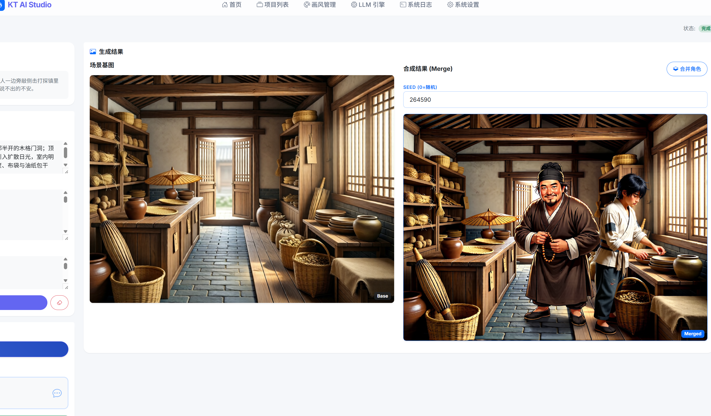
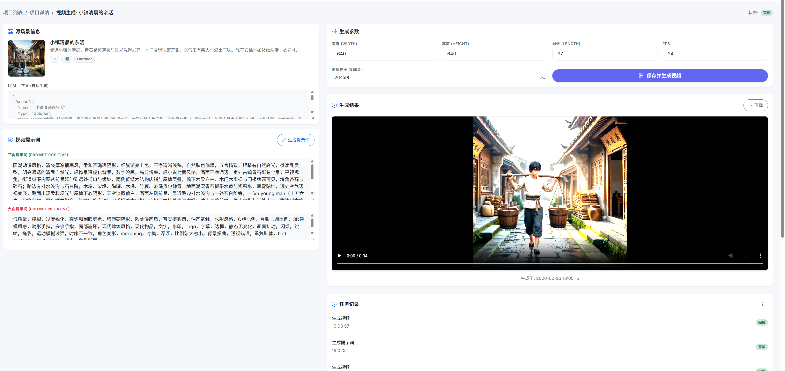

# ✨ KT-AI-Studio

<p align="center">
  
</p>

<p align="center">
  <strong>
    LLM 驱动的 ComfyUI 自动化漫剧 / 图像 / 视频生成工作室
  </strong>
</p>

<p align="center">
  <em>
    人物一致性 · 场景一致性 · 风格一致性 · 无需训练 LoRA
  </em>
</p>

<p align="center">
  
  
  
  
</p>

---

## 📌 项目简介

**KT-AI-Studio** 是一套基于 **ComfyUI + 大语言模型（LLM）** 的自动化生成工具，  
用于批量生成 **漫画、漫剧分镜、图像或视频内容**。

你可以把它理解为：

> **一个由 LLM 负责任务规划与提示词生成，  
> 由 ComfyUI 负责高质量本地生成的自动化工作室。**

项目的目标不是「一键出神作」，  
而是 **自动化重复劳动，让创作者把精力集中在创意本身**。

---

## 🧠 整体架构 & 工作流程

<p align="center">
  
</p>

## ✨ 界面演示

<div align="center">
  <table>
    <tr>
      <td align="center"> <br/> 首页 Dashboard</td>
      <td align="center"> <br/> 项目列表</td>
    </tr>
    <tr>
      <td align="center"> <br/> 项目详情 & 一键生成</td>
      <td align="center"> <br/> 人物管理 & 生成</td>
    </tr>
    <tr>
      <td align="center"> <br/> 场景管理 & 生成</td>
      <td align="center"> <br/> 视频生成</td>
    </tr>
    <tr>
      <td align="center"> <br/> 系统日志监控</td>
      <td align="center"> <br/> 系统设置</td>
    </tr>
  </table>
</div>

**核心流程：**

1. 使用内置的结构化 Prompt 模板
2. 向 LLM 请求人物与场景信息
3. 生成人物 / 场景基础素材
4. 再次向 LLM 请求适配 ComfyUI 的最终提示词
5. 通过 ComfyUI API 自动执行工作流
6. 输出图像或视频结果

👉 **全流程自动化，无需人工反复干预**

---

## 🚀 核心特点

### ✅ 支持本地运行，但推荐 LLM 走 API

项目支持 **完全本地运行**，  
但不推荐将 **LLM 与 ComfyUI 同时运行在同一张显卡上**：

- 本地 LLM 会占用大量显存
- 极易导致 ComfyUI 在生成阶段显存溢出

**推荐实践方式：**

| 模块 | 推荐方式 |
|----|----|
| LLM 推理 | API（ChatGPT / DeepSeek 等） |
| 图像 / 视频生成 | 本地 ComfyUI |
| 显存压力 | 可控 |
| 稳定性 | 高 |

---

### 🎭 无需训练 LoRA，也能实现一致性

在不训练 LoRA 的前提下，实现：

- 人物一致性  
- 场景一致性  
- 风格一致性  
- 提示词自动扩写与结构化约束  

---

### 🧩 对 ComfyUI 高度友好

项目 **不绑定任何固定模型或工作流**。

你可以自由使用：

- 自己的模型  
- 自己的 LoRA  
- 自己的 ComfyUI Workflow  

**只需保证以下节点 ID 与项目模板一致即可：**

- 正向提示词（Positive Prompt）
- 负向提示词（Negative Prompt）
- Seed
- Width / Height
- Length（视频时长）

无需修改代码，即可直接接入使用。

---

## ⚡ 当前功能特性 (Features)

KT-AI-Studio 目前已实现了一套完整的**漫剧与视频自动化生产流**，涵盖从创意到生成的全链路：

### 🛠️ 核心架构
*   **Web 界面**: 基于 FastAPI + Jinja2 的现代化 Web 控制台，操作直观。
*   **任务队列**: 内置后台任务管理器，支持批量、异步处理耗时的生成任务。
*   **ComfyUI 深度集成**: 双向 WebSocket 通信，支持工作流排队、中断、进度实时监控。
*   **多 LLM 支持**: 完美兼容 OpenAI 接口（DeepSeek, ChatGPT, Claude 等），支持本地/远程模型配置。

### 🎨 风格与项目管理
*   **画风锁定 (Style Guard)**: 强制统一项目的视觉风格（写实/动漫/水墨等），防止画风漂移。
*   **自动提示词工程**: LLM 自动注入正向/负向风格词，无需手动编写复杂的 Prompt。

### 🧑‍🤝‍🧑 角色 (Character) 系统
*   **角色一致性**: 通过生成**基础立绘**与**多视角三视图**，固定人物特征。
*   **智能扩写**: 只需简短描述，LLM 自动扩写出包含外观、体型、服装、质感的结构化提示词。
*   **数据管理**: 集中管理角色的基础图、多视角图与元数据。

### 🎬 场景 (Scene) 与剧情
*   **自动剧情拆解 (Auto Story)**:
    *   **一句话生成漫剧**: 仅需输入一段剧情梗概（例如：“陈平安接下齐静春嘱托，启程护送李宝瓶三人南下。大骊皇后派高手截杀，阿良突然现身...”）。
    *   LLM 自动提取关键信息：**出场人物**、**分幕场景**、**场景类型**、**角色对白**。
    *   直接生成可供自动化任务使用的结构化数据，无需人工手动拆分剧本。
*   **场景指纹**: 生成包含空间结构、材质、光影的客观场景描述，确保场景逻辑一致。
*   **智能合成 (Compositing)**: LLM 根据透视关系，自动规划多人站位（前景/中景/远景）与比例，将角色完美融入场景。

### 🎥 视频 (Video) 生成
*   **图生视频 (Image-to-Video)**: 集成 **Wan2.2 (万象)** 等前沿模型，一键将静态场景转为动态视频。
*   **对白驱动**: 若场景包含对白，LLM 会自动引导角色生成“说话/神态”动作（无字幕），提升生动感。
*   **参数自适应**: 自动推算最佳 FPS 与时长，支持手动微调。

### 🔌 内置工作流
*   `wf_base_character`: Qwen Image 高质量图像生成
*   `wf_8views`: 角色三视图/多视图生成
*   `image_z_image_turbo`: Z-Image Turbo 极速图像生成
*   `video_wan2_2_14B_i2v`: Wan2.2 高质量图生视频流
*   `video_ltx2_i2v`: LTX2 图生视频流 (基础版)
*   `video_ltx2_i2v(lora)`: LTX2 图生视频流 (含运镜LoRA)
*   *(更多工作流持续更新中...)*

---

## �️ 快速上手

### 1. 环境准备与代码克隆
请将 ComfyUI 与本项目分别克隆到两个独立的目录中，避免文件混淆。

```bash
# 克隆 ComfyUI (如果您还没有)
git clone https://github.com/Comfy-Org/ComfyUI.git

# 克隆 KT-AI-Studio
git clone https://github.com/oskey/kt-ai-Studio.git
```

### 2. ComfyUI 初始化与启动
如果您是全新安装 ComfyUI，可以使用本项目提供的辅助脚本进行快速配置：

1.  复制 `docs/comfyui_sh/` 目录下的脚本到您的 `ComfyUI` 根目录。
2.  运行 install_flash_attention_uv.ps1 脚本进行依赖安装及环境初始化。

> **提示**：确保您的 Python 环境版本 >= 3.10。

### 3. 开启 ComfyUI API
本项目依赖 ComfyUI 的 API 接口进行通信。
您可以使用 `docs/comfyui_sh/Start-ComfyUI.ps1` 脚本来启动 ComfyUI。

### 4. 下载模型
请根据您的工作流需求，下载对应的 Checkpoint / LoRA / VAE 模型，并放置在 `ComfyUI/models/` 对应的子目录中。
具体模型列表请参考下方的 [📦 使用到的模型说明](#-使用到的模型说明非常重要)。

### 5. 安装本项目依赖
进入 `KT-AI-Studio` 目录，安装 Python 依赖：

```bash
cd kt-ai-Studio
pip install -r requirements.txt
```

### 6. 启动 KT-AI-Studio
在 `KT-AI-Studio` 根目录下运行以下命令启动服务：

```bash
# Windows / Linux / macOS
cd kt_ai_studio
python -m app.main
```

启动成功后，请使用浏览器访问：[http://127.0.0.1:8000](http://127.0.0.1:8000)

### 7. 系统配置
首次进入系统后，请前往 **系统设置 (System Settings)** 页面：

1.  **LLM 引擎配置**：
    *   本项目默认支持 OpenAI 格式接口。
    *   您可以配置 **本地 LLM** (如 Ollama / LM Studio) 或 **远程 LLM** (如 DeepSeek / ChatGPT)。
    *   *注意：开发测试环境使用的是 OpenAI 接口。*
2.  **ComfyUI 地址配置**：
    *   确保填写的 ComfyUI 地址 (如 `http://127.0.0.1:8188`) 正确且可访问。

---

## 📦 使用到的模型说明（非常重要）

### 🟣 Qwen 系列模型 (基础图像生成)

| 路径 | 模型名称 | 说明 |
| :--- | :--- | :--- |
| `/models/unet/` | `qwen_image_2512_fp8_e4m3fn.safetensors` | Qwen Image 2.5 主模型 (FP8 量化) |
| `/models/loras/` | `Qwen-Image-Lightning-4steps-V1.0.safetensors` | 4步极速采样 LoRA |
| `/models/vae/` | `qwen_image_vae.safetensors` | Qwen 专用 VAE |
| `/models/clip/` | `qwen_2.5_vl_7b_fp8_scaled.safetensors` | Qwen 2.5 VL 视觉语言模型 (CLIP) |

### 🚀 Z-Image Turbo 系列模型 (极速图像生成)

| 路径 | 模型名称 | 说明 |
| :--- | :--- | :--- |
| `/models/unet/` | `z_image_turbo_bf16.safetensors` | Z-Image Turbo 主模型 (BF16) |
| `/models/clip/` | `qwen_3_4b.safetensors` | Z-Image 配套 CLIP (Qwen 3.4B) |
| `/models/vae/` | `ae.safetensors` | 通用 VAE |

### 🔵 Wan 2.2 系列模型 (视频生成)

| 路径 | 模型名称 | 说明 |
| :--- | :--- | :--- |
| `/models/unet/` | `wan2.2_i2v_high_noise_14B_fp8_scaled.safetensors` | Wan2.2 图生视频高噪模型 (14B FP8) |
| `/models/unet/` | `wan2.2_i2v_low_noise_14B_fp8_scaled.safetensors` | Wan2.2 图生视频低噪模型 (14B FP8) |
| `/models/loras/` | `wan2.2_i2v_lightx2v_4steps_lora_v1_high_noise.safetensors` | Wan2.2 4步加速 LoRA (高噪) |
| `/models/loras/` | `wan2.2_i2v_lightx2v_4steps_lora_v1_low_noise.safetensors` | Wan2.2 4步加速 LoRA (低噪) |
| `/models/vae/` | `wan_2.1_vae.safetensors` | Wan 2.1/2.2 专用 VAE |
| `/models/clip/` | `umt5_xxl_fp8_e4m3fn_scaled.safetensors` | UMT5 XXL 文本编码器 |

### 🟢 LTX2 系列模型 (视频生成)

| 路径 | 模型名称 | 说明 |
| :--- | :--- | :--- |
| `/models/checkpoints/` | `ltx-2-19b-dev-fp8.safetensors` | LTX Video 2.0 主模型 (19B FP8) |
| `/models/loras/` | `ltx-2-19b-distilled-lora-384.safetensors` | LTX 蒸馏加速 LoRA |
| `/models/loras/` | `ltx-2-19b-lora-camera-control-dolly-left.safetensors` | LTX 运镜控制 LoRA (Dolly Left) |
| `/models/upscale_models/` | `ltx-2-spatial-upscaler-x2-1.0.safetensors` | LTX 空间放大模型 (x2) |
| `/models/clip/` | `gemma_3_12B_it_fp4_mixed.safetensors` | Gemma 3 文本编码器 (用于 LTX) |

---

## 📅 未来 Pro 版本计划 (Roadmap)

我们正在持续迭代 KT-AI-Studio，以下功能计划在未来版本中推出：

1.  **🖼️ 参考图重构人物 (Character Refactoring)**
    *   无需复杂的 Prompt，直接通过上传参考图对人物进行重构。
    *   实现完全自定义的角色形象定制。

2.  **🎬 视频无限延长 (Video Extension)**
    *   基于 `ffmpeg` 的尾帧抽帧技术。
    *   根据当前场景剧情，自动化生成更长的连贯视频。

3.  **🔌 适配更多 ComfyUI 工作流**
    *   扩展支持更多主流的 ComfyUI 节点和工作流模板。
    *   提供更灵活的参数映射配置。

4.  **📤 一键导出与合成 (One-Click Export)**
    *   通过 `ffmpeg` 自动合并项目中的所有生成图片或视频。
    *   支持导出为完整的漫剧视频或长图。

5.  **🎞️ 首尾帧工作流支持**
    *   增加对首尾帧控制的支持，提升视频转场的流畅度。

6.  **🤖 更多智能化生产 (AI Production)**
    *   我们坚信：只要硬件配置足够，接入 LLM 模型的 ComfyUI 完全可以实现全自动化的内容生产。
    *   未来将探索更多 AI 驱动的自动化场景。